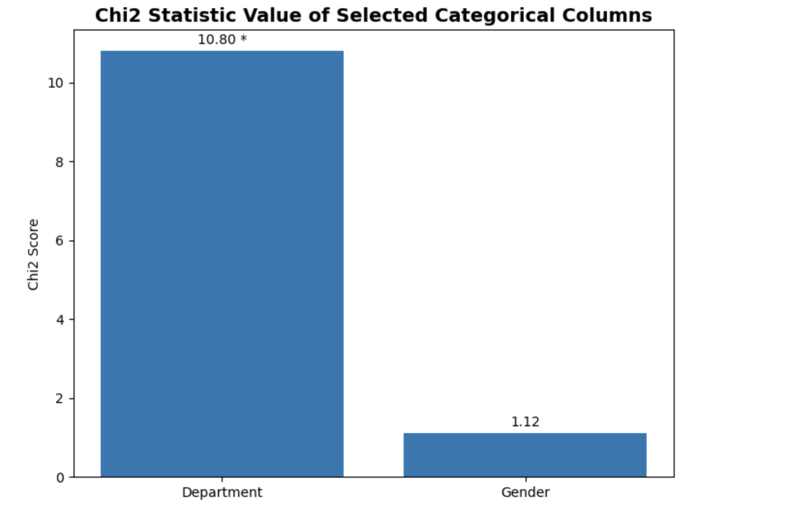
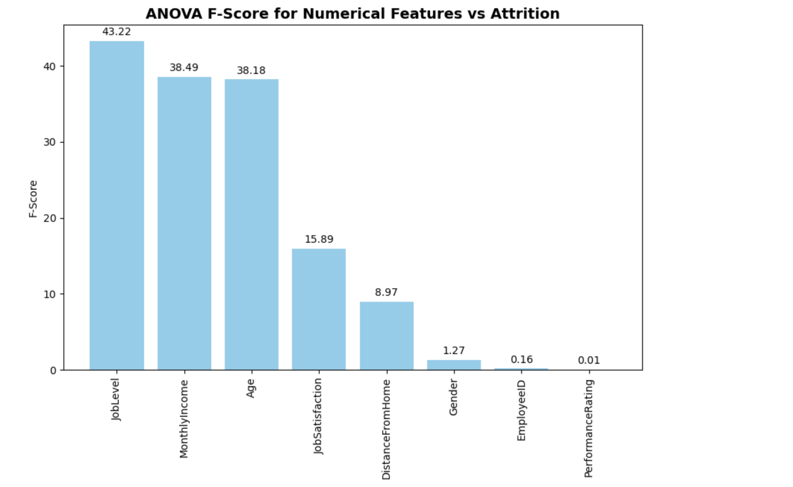
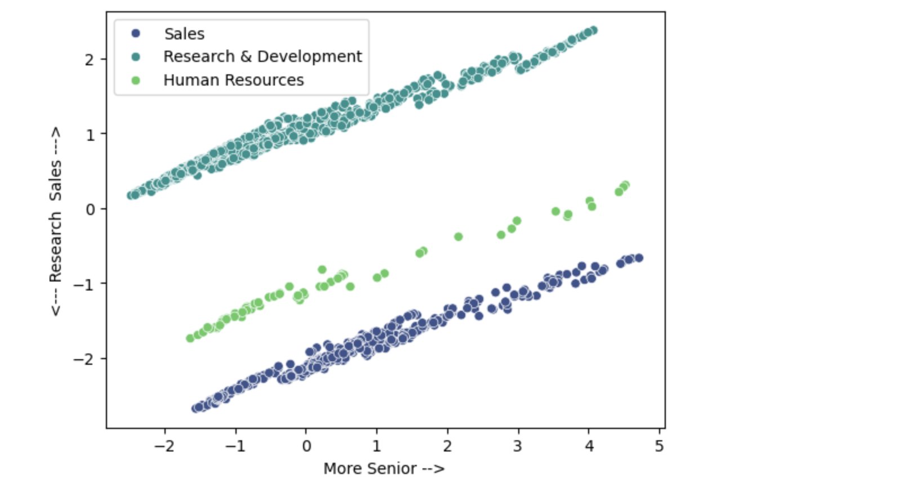
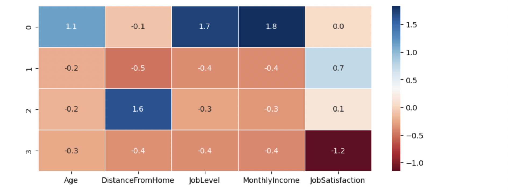
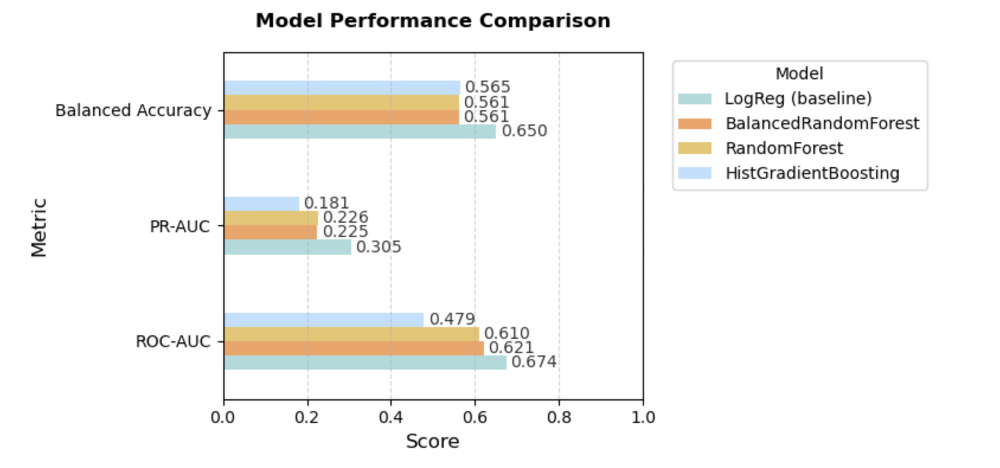

# Problem Statement
This project will use a two-step approach to analyze and address employee attrition. First, Employee Segmentation (Clustering) will group employees with similar characteristics. Then, Attrition Prediction (Classification) will identify which employees are most at risk of leaving. Together, these methods help HR teams understand not just who is at risk, but also why certain groups are more vulnerable, enabling more targeted and effective interventions.

# Model Outcomes and Predictions: 

## 📌 Overview
This project explores an HR dataset (provided in the repository) to identify key factors associated with employee attrition. Both unsupervised learning (clustering) for segmenting data and supervised learning (classification) for churn prediction are used.
The workflow includes:
### Part 1: Clustering - The goal is to segment employees into meaningful groups for HR insights.

- Data exploration & cleaning
- Feature selection using **Chi-Square** (categorical features) and **ANOVA** (numerical features)
- Clustering using **KMeans**
- Dimensionality reduction with **PCA**
- Iterative refinement of clustering after noticing department features dominated the clusters. Department data was dropped to rerun the model.

### Part 2: Classification - The goal is to create a model for churn prediction.

- Logistic Regression Model is used as a baseline model. 
- Balanced Random Forest Model, Random Forest Model and HGBoost Model are also used for comparison. 
---

## 📊 Data Aqusition: 
The dataset is provided in a csv file in the repository. It is provided by Maven Analytics as a free practice dataset. You can also find it in Kaggle. 
The dataset includes both categorical and numerical employee attributes such as:
- **Categorical**: Gender, Department, JobRole, MaritalStatus, Overtime, etc.
- **Numerical**: Age, MonthlyIncome, JobLevel, DistanceFromHome, JobSatisfaction, YearsAtCompany, etc.
- **Target**: Attrition (Yes/No)

---

## 🔍 Data Processing 

### 1. Data Exploration & Cleaning
- Converted `Attrition` from *Yes/No* → *1/0*. Yes (1) means the individual has left the company and No (0) means the person has stayed. 
- Encoded categorical variables (`Gender`, `Department`, etc.) using dummy variables
- Handled irrelevant columns (e.g., dropped `EmployeeID`)

### 2. Feature Selection
- **Chi-Square Test**: evaluated dependence between categorical features and attrition  
  - Example: `Department` was significant, `Gender` was not as significant
  

- **ANOVA (F-test)**: tested differences in numeric features across attrition groups  
  - Key predictors: `JobLevel`, `MonthlyIncome`, `Age`, `JobSatisfaction`, `DistanceFromHome`  
  

### 3. Initial KMeans Clustering
- Applied KMeans to scaled features
- Found 4 clusters using elbow method (inertia values) and silhouette scores.

### 4. Dimensionality Reduction with PCA
- Used PCA to reduce dimensionality for visualization
- Observed PC2 was almost entirely explained by Department. The Department data strongly influenced the cluster formation and overshadowed more nuanced employee characteristics, so I decided to drop the Department data from KMean model.
- Decision: rerun KMeans without Department to uncover **behavioral/attrition-related** patterns  
  

### 5. Refined KMeans Clustering
- Re-ran clustering without Department
- Used elbow method and silhouette scores to come up with 4 clusters 
- Interpreted 4 distinct employee clusters:
  - **Cluster 0 – Senior & Stable**: Older, higher-level, higher income, stable satisfaction  
  - **Cluster 1 – Early Career but Satisfied**: Younger, entry-level, lower income, but happier  
  - **Cluster 2 – Commute Risk Group**: Longer commutes, average pay, lower satisfaction  
  - **Cluster 3 – Disengaged & Dissatisfied**: Younger, lower-level, least satisfied (highest attrition risk)  
  

### 6. Classification Models for Employee Churn Prediction
I experimented with **four classification algorithms** to evaluate performance on this imbalanced dataset:

| Model | Description | Preprocessing |
|--------|--------------|-------|
| **1. Logistic Regression (Baseline)** | A simple, interpretable linear model predicting the log-odds of churn. | Applied **SMOTE** (Synthetic Minority Oversampling Technique) to balance classes and **StandardScaler** for normalization. |
| **2. Random Forest Classifier** | Ensemble of decision trees using bagging and feature randomness. | Handles nonlinear relationships and doesn’t require feature scaling. |
| **3. Balanced Random Forest Classifier** | A variation of Random Forest that uses balanced bootstrapping to handle class imbalance directly. | Reduces bias toward the majority class. |
| **4. HistGradientBoosting Classifier** | Gradient boosting model using histogram-based optimization for speed and scalability. | Works well with complex, nonlinear data but was less effective on this dataset. |

---

### 7. Techniques and Preprocessing
- **Train/Test Split:** 80/20 split with stratification to preserve class ratio  
- **Feature Scaling:** Applied `StandardScaler` to numeric features (only for Logistic Regression)  
- **Class Imbalance Handling:**  
  - Used **SMOTE** to oversample the minority (churn) class in training data  
  - For tree-based models, imbalance handled internally (BalancedRF)  
- **Evaluation Metrics:**  
  - ROC-AUC  
  - Precision–Recall AUC (PR-AUC)  
  - Balanced Accuracy  
  - Confusion Matrix  

---

### 📊 Model Evaluation / Performance Comparison
The chart below compares the performance of all four models across ROC-AUC, PR-AUC, and Balanced Accuracy:

**Insight:**  
Logistic Regression outperformed all other models in this dataset, achieving:  
- **ROC-AUC:** 0.674  
- **PR-AUC:** 0.305  
- **Balanced Accuracy:** 0.650  

---

### 🔍 Feature Importance (Logistic Regression)
Since **churn = 1**, positive coefficients indicate higher churn risk, while negative coefficients indicate retention factors.

| Feature | Coefficient | Interpretation |
|----------|--------------|----------------|
| **Department_Sales** | +0.29 | Employees in Sales are more likely to churn. |
| **DistanceFromHome** | +0.18 | Longer commutes increase churn risk. |
| **Gender_Male** | +0.09 | Males show slightly higher churn tendency. |
| **JobSatisfaction** | −0.35 | Higher satisfaction reduces churn risk. |
| **Age** | −0.38 | Older employees are less likely to churn. |

---

## 💡 Key Insights
- `Department` is highly separable but not always helpful for clustering employees by attrition risk  
- The most vulnerable group is **Cluster 3 – Disengaged & Dissatisfied**, which combines low pay, junior roles, and low satisfaction  
- Clustering is more meaningful when department is analyzed **after** clustering, not included in the clustering features
- **Best Classfication Model:** Logistic Regression  
- **Key Churn Drivers:** Department, Distance from Home, and Job Satisfaction  
- **Key Retention Drivers:** Age and Monthly Income  
- **Interpretation:** The most influential factors of churn were organizational context (Sales department) and personal circumstances (commuting distance, satisfaction).  

---

## 🚀 Next Steps
- Overlay **attrition rates per cluster** to validate high-risk groups
- Tune hyperparameters for Logistic Regression and run stratified cross-validation to improve the results
- Provide HR recommendations for targeted retention strategies  

---

## 📂 Repository Structure
